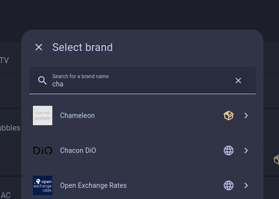
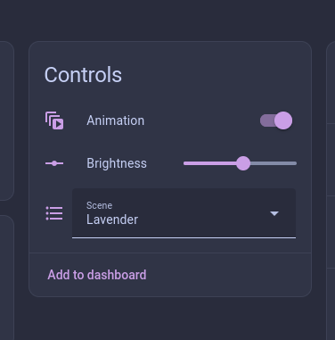

<p align="center">
  
</p>

# Chameleon

**Extract colors from images and apply them to your RGB lights.**

Chameleon is a custom component for [Home Assistant](https://www.home-assistant.io/) that automatically extracts colors from images and applies them to your lights. Perfect for creating ambient lighting that matches your favorite photos, artwork, or movie posters.

## Features

- **Image-based scenes**: Drop images in a folder, Chameleon auto-discovers them as scenes
- **Multi-light support**: Distribute extracted colors across multiple lights
- **Color palette extraction**: Uses advanced color extraction for vibrant, representative colors
- **Animation mode**: Cycle through colors from an image
- **Native HA integration**: Works with the built-in select entity UI

## Screenshots


_Configure your RGB lights in the setup flow_


_Control scenes, brightness, and animation from your dashboard_

## Installation

### HACS (Recommended)

[](https://my.home-assistant.io/redirect/hacs_repository/?owner=MKSG-MugunthKumar&repo=ha-chameleon&category=integration)

1. Open HACS in Home Assistant
2. Click the three dots menu → Custom repositories
3. Add this repository URL with category "Integration"
4. Search for "Chameleon" and install
5. Restart Home Assistant

### Manual Installation

1. Copy the `custom_components/chameleon` folder to your `config/custom_components/` directory
2. Restart Home Assistant

## Configuration

1. Go to **Settings** → **Devices & Services** → **Add Integration**
2. Search for "Chameleon"
3. Select the RGB light(s) you want to control
4. Add images to `/config/www/chameleon/`

That's it! A select entity will be created that shows all available scenes.

## Usage

### Adding Scenes

Drop image files into `/config/www/chameleon/`:

```
/config/www/chameleon/
├── sunset_vibes.jpg      → "Sunset Vibes"
├── ocean-blue.png        → "Ocean Blue"
├── forest_morning.jpg    → "Forest Morning"
└── movie_poster.png      → "Movie Poster"
```

Filenames are automatically converted to scene names (underscores/hyphens become spaces, title case applied).

### Example Images

We've included some example images to get you started. Copy them from [`examples/images/`](examples/images/) to your `/config/www/chameleon/` folder:

| Image                    | Palette                     | Best For                   |
| ------------------------ | --------------------------- | -------------------------- |
| `beach sunset.jpg`       | Warm oranges, pinks, golds  | Relaxing evening ambiance  |
| `dusk.jpg`               | Soft purples, blues, pinks  | Calm twilight mood         |
| `blue waters.jpg`        | Cool blues, teals           | Serene, focused atmosphere |
| `greenery.jpg`           | Natural greens, earth tones | Fresh, organic feel        |
| `greenish blue lake.jpg` | Teal, aqua, green           | Tranquil nature vibe       |
| `abstract green.jpg`     | Vibrant greens              | Modern, artistic energy    |
| `artistic purple.jpg`    | Deep purples, violets       | Creative, moody ambiance   |

All example images are from [Unsplash](https://unsplash.com) and free to use.

### Selecting Scenes

Use the select entity in:

- Home Assistant UI (entity card, more-info dialog)
- Automations
- Scripts
- Voice assistants

### Example Dashboard Card

Add this to your Lovelace dashboard to create a control panel for Chameleon:

```yaml
type: vertical-stack
cards:
  # Scene selector with entity picture
  - type: entities
    title: Chameleon
    entities:
      - entity: select.bedroom_lamp_scene
        name: Scene
      - entity: number.bedroom_lamp_brightness
        name: Brightness
      - entity: switch.bedroom_lamp_animation
        name: Animation Mode
    show_header_toggle: false

  # Alternative: Compact horizontal controls
  - type: horizontal-stack
    cards:
      - type: entity
        entity: select.bedroom_lamp_scene
        name: Scene
      - type: entity
        entity: switch.bedroom_lamp_animation
        icon: mdi:animation-play
```

**Complete Control Card** (recommended):

```yaml
type: vertical-stack
cards:
  - type: custom:mushroom-title-card
    title: "🎨 Chameleon"
    subtitle: Ambient lighting from images
  - type: entities
    entities:
      - entity: select.bedroom_lamp_scene
        name: Scene
        icon: mdi:palette
      - entity: number.bedroom_lamp_brightness
        name: Brightness
      - entity: switch.bedroom_lamp_animation
        name: Animation
    state_color: true
```

> **Note**: Replace `bedroom_lamp` with your light's base name. Entity IDs follow the pattern:
>
> - `select.{light_name}_scene`
> - `number.{light_name}_brightness`
> - `switch.{light_name}_animation`

### Custom Lovelace Card

We don't have a dedicated Lovelace card yet, but we'd love one! A custom card could include:

- Image thumbnail preview of the selected scene
- Color palette visualization
- Integrated brightness slider and animation toggle
- Scene quick-select buttons

**Interested in building it?** See the [Developer Guide](#chameleon-integration---developer-guide) and open an issue to discuss!

### State Attributes

The select entity exposes useful attributes:

| Attribute        | Description                               |
| ---------------- | ----------------------------------------- |
| `light_entities` | List of configured light entity IDs       |
| `light_count`    | Number of configured lights               |
| `applied_colors` | Dict of entity_id → RGB color             |
| `last_error`     | Error message if last operation failed    |
| `failed_lights`  | Dict of failed lights with error messages |

### Services

```yaml
# Apply a scene programmatically
service: select.select_option
target:
  entity_id: select.bedroom_lamp_scene
data:
  option: "Sunset Vibes"
```

## Multi-Light Setup

When configuring multiple lights:

1. Chameleon extracts a color palette from the image
2. Each light receives a different color from the palette
3. Colors are distributed in the order lights are configured

This creates a cohesive but varied lighting atmosphere.

## Error Handling

Chameleon provides detailed feedback when things go wrong:

- **Light not found**: Entity doesn't exist in HA
- **Light unavailable**: Device is offline
- **No RGB support**: Light doesn't support color mode
- **Service call failed**: HA service error

Check the `last_error` and `failed_lights` attributes for details.

## Database Considerations

Chameleon uses light transitions (default: 2 seconds) for smooth color changes. This means one state change per transition, not per color step. Animation mode creates frequent state changes. At 1 color/second, that's **86,400 database writes per day** per light.

### Recommended: Recorder Exclusion

Exclude animated lights from the recorder to prevent database bloat:

```yaml
# configuration.yaml
recorder:
  exclude:
    entities:
      - light.your_animated_light
    entity_globs:
      - light.chameleon_*
```

### Animation Speed

Default animation interval is 5 seconds. Adjust based on your needs:

- **Slow (10-60s)**: Subtle ambiance
- **Medium (5-10s)**: Good balance
- **Fast (1-5s)**: More dynamic

Regardless of speed, consider recorder exclusion for animated lights.

## Troubleshooting

### Select Entity Shows No Options

1. Verify `/config/www/chameleon/` directory exists
2. Check file extensions are `.jpg`, `.jpeg`, or `.png`
3. Check logs: `logger.logs.custom_components.chameleon: debug`
4. Options refresh every 30 seconds

### Colors Look Wrong

- Ensure images are RGB format (not CMYK)
- Test with a simple, high-contrast image first
- Check if the light supports full RGB range

### Light Not Responding

Check the `failed_lights` attribute:

- `not_found`: Verify the entity ID is correct
- `unavailable`: Check the device is online
- `no_rgb_support`: Use an RGB-capable light
- `service_call_failed`: Check HA logs for details

## License

MIT License - see [LICENSE](LICENSE) for details.

## Acknowledgments

Inspired by:

- [adaptive-lighting](https://github.com/basnijholt/adaptive-lighting) - For multi-instance config flow patterns
- [scenery](https://github.com/home-assistant/core) - For select entity patterns

Libraries used:

- [ColorThief](https://github.com/fengsp/color-thief-py) - Color extraction library

## Chameleon Integration - Developer Guide

Are you a developer? Continue reading for architecture details, error handling strategies, and development workflow.

## Architecture Overview

### Module Responsibilities

| Module                | Responsibility                                               |
| --------------------- | ------------------------------------------------------------ |
| `__init__.py`         | Integration entry point, setup/unload                        |
| `config_flow.py`      | UI configuration flow                                        |
| `const.py`            | All constants and configuration keys                         |
| `select.py`           | Select entity (scene selection UI)                           |
| `light_controller.py` | Shared light control logic (availability, color application) |
| `color_extractor.py`  | Color extraction from images                                 |
| `animations.py`       | Animation loop management                                    |

### Key Design Pattern: Separation of Concerns

The `light_controller.py` module contains all light control logic shared between:

- Select entity (`select.py`)
- Services (future: `apply_scene`, `start_animation`, `stop_animation`)

This separation ensures consistent behavior and error handling across all light control operations.

## Error Handling Strategy

### Light Availability Checks

Before applying colors, the integration checks:

1. **Entity exists**: Light entity is registered in HA
2. **Entity available**: Not in `unavailable` or `unknown` state
3. **RGB support**: Light supports RGB, RGBW, RGBWW, HS, or XY color modes

### Error Tracking

Errors are tracked in entity state attributes:

- `last_error`: Human-readable error message (cleared on success)
- `failed_lights`: Dict of entity_id → error message

This allows:

- UI display of errors
- Automation triggers based on failures
- Debugging without checking logs

### Failure Modes

| Scenario           | Behavior                                     |
| ------------------ | -------------------------------------------- |
| All lights succeed | Update `current_option`, clear errors        |
| All lights fail    | Keep previous `current_option`, set error    |
| Partial failure    | Update `current_option`, track failed lights |

### Production Testing

- Test with real Philips Hue or RGB lights
- Verify color accuracy
- Test animation smoothness
- Monitor DB writes (check recorder size growth)

## Common Issues

### Image Directory Not Found

- Ensure `/config/www/chameleon/` exists
- Integration should create it on first setup if missing

### Colors Look Wrong

- Check image format (RGB vs RGBA)
- Verify color space conversions
- Test with known-good images first

### Select Entity Not Showing Options

- Check image directory scan logic
- Verify file extensions (jpg, png)
- Check logs for errors (set `logger.logs.custom_components.chameleon: debug`)

### Light Not Responding

Check the `failed_lights` attribute for detailed error messages:

- `not_found`: Entity doesn't exist
- `unavailable`: Device offline
- `no_rgb_support`: Light doesn't support colors
- `service_call_failed`: HA service error

## Development Workflow

### Quick Start

```bash
make dev-setup    # First time: install tools + start server
make dev-start    # Start server (if already set up)
make dev-restart  # Reload code changes
make dev-logs     # View logs
```

### Deploy to Production (Your own HA instance)

```bash
# Sync to production server
rsync -avz --delete \
  ~/ha-chameleon/custom_components/chameleon/ \
  your-server:/config/custom_components/chameleon/

# Restart production HA
ssh your-server "docker restart homeassistant"

# Monitor logs
ssh your-server "docker logs -f homeassistant"
```

---

## Translations

Chameleon currently supports **English only**. We'd love help translating to other languages!

If you're fluent in another language and want to contribute translations, check out our [Contributing Guide](CONTRIBUTING.md#translations) for instructions.

## Call for Developers: Custom Lovelace Card

We're looking for frontend developers to build a dedicated **Chameleon Lovelace Card**!

### Why a Custom Card?

The built-in entities work great, but a dedicated card could provide:

- **Image thumbnail preview** of the currently selected scene
- **Color palette visualization** showing extracted colors
- **Integrated controls** for scene, brightness, and animation in one card
- **Scene quick-select** with image thumbnails instead of a dropdown

### Technical Details

The card would interact with these entities:

| Entity                      | Type   | Purpose                     |
| --------------------------- | ------ | --------------------------- |
| `select.{light}_scene`      | Select | Scene selection             |
| `number.{light}_brightness` | Number | Brightness control (1-100%) |
| `switch.{light}_animation`  | Switch | Animation toggle            |

State attributes available on the select entity:

- `applied_colors` - Dict of light entity → RGB tuple
- `light_entities` - List of controlled lights
- `is_animating` - Boolean animation state

Images are stored in `/config/www/chameleon/` (accessible via `/local/chameleon/`).

### Interested?

1. Open an issue to discuss your approach
2. Check out [custom-cards/boilerplate-card](https://github.com/custom-cards/boilerplate-card) for a starting point
3. We're happy to add any needed state attributes or features to support the card

## Contributing

Contributions welcome! See [CONTRIBUTING.md](CONTRIBUTING.md) for guidelines.

Quick start:

1. Fork the repository
2. Create a feature branch
3. Run `make check` before submitting
4. Submit a pull request

---

## Future Features

### Custom Lovelace Card

- [ ] **Custom Lovelace card** - Dedicated card with image preview and controls (see [call for developers](#call-for-developers-custom-lovelace-card))
- [ ] **Customizable UI elements** - Allow users to modify card appearance and behavior

### Media Player Integration

- [ ] **Album art color extraction** - Extract colors from media player's currently playing album cover
- [ ] **Media player selector** - Allow users to configure a media player entity as color source
- [ ] **Auto-update on track change** - Automatically update lights when song changes
- [ ] **Fallback to static scene** - Use configured scene when media player is idle/off

### Animation Features

- [ ] Animation patterns (fade, pulse, wave)
- [ ] Animation presets
- [ ] Scene presets with multiple images
- [ ] Time-based scene selection
- [ ] Integration with HA scenes

### Alternative Color Extraction Libraries

- [ ] **Haishoku** - Python library, alternative to ColorThief
- [ ] **K-means clustering** - Custom implementation using scikit-learn or numpy
- [ ] **Configurable extractor** - Allow users to choose extraction method

### Spatial Sampling (Experimental)

- [ ] **Grid-based region sampling** - Sample colors from different image regions
- [ ] **Left/center/right distribution** - Assign region colors to lights by position
- [ ] **Custom region mapping** - User-defined light-to-region assignments

---

## Author

Created by [@mk_sg](https://mastodon.social/@mk_sg) - Follow for updates and other projects!
